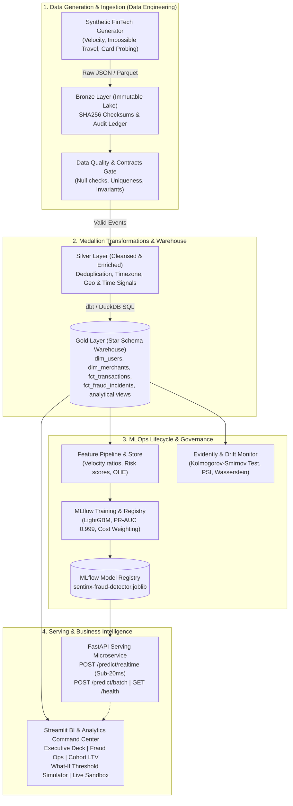

# 🛡️ SentinX: Enterprise FinTech Data & MLOps Platform

[](https://python.org)
[](https://duckdb.org)
[](https://getdbt.com)
[](https://mlflow.org)
[](https://fastapi.tiangolo.com)
[](https://streamlit.io)
[](https://github.com)

**SentinX** is a unified, production-grade **Data Engineering, Data Analytics, and MLOps Platform** simulating an enterprise financial transaction network. It delivers end-to-end streaming/batch ingestion, Medallion star schema warehousing, automated data contract validation, machine learning fraud detection, model registry tracking with MLflow, sub-20ms low-latency inference serving via FastAPI, covariate drift monitoring with statistical hypothesis testing, and an interactive executive BI command center with What-If scenario simulation.

---

## 🏛️ System Architecture



---

## 🎯 Role Capabilities Demonstrated

| Domain | Key Capabilities Demonstrated |
| :--- | :--- |
| **Data Engineering** | • Medallion Architecture (Bronze $\rightarrow$ Silver $\rightarrow$ Gold)<br/>• Partitioned Parquet data lake with SHA256 cryptographic audit logs<br/>• Automated Data Quality contracts & schema invariant gates (`quality.py`)<br/>• Star Schema dimensional modeling in DuckDB (`dim_users`, `dim_merchants`, `fct_transactions`)<br/>• Production dbt models with staging, intermediate window velocity aggregations, and marts<br/>• Pipeline orchestrator with execution telemetry and failure recovery |
| **Data Analytics** | • Semantic layer KPIs: Gross Merchandise Value (GMV), Fraud Exposure Rate, Loss Prevented<br/>• Customer Cohort Retention & Lifetime Value (LTV) analysis (`New`, `Established`, `Mature`, `Veteran`)<br/>• Merchant category risk profiling & chargeback correlation analysis<br/>• What-If Risk Threshold Scenario Simulator modeling financial trade-offs (Fraud Loss vs Customer Friction Cost)<br/>• Executive-grade Plotly interactive data visualizations |
| **MLOps** | • Feature store pipeline: windowed velocity, user baseline ratios, cross-border anomaly flags<br/>• Experiment tracking & model registry with **MLflow** (logging params, PR-AUC, ROC-AUC, artifacts)<br/>• Cost-sensitive LightGBM classifier handling severe class imbalance (3.8% fraud ratio)<br/>• Sub-20ms low-latency model serving microservice with **FastAPI** & Pydantic V2 validation<br/>• Statistical Covariate & Data Drift monitoring using Kolmogorov-Smirnov (KS-test), PSI, and Wasserstein distance |

---

## 🚀 Quickstart Guide

### Prerequisites
- Python 3.11, 3.12, or 3.13
- [`uv`](https://github.com/astral-sh/uv) (recommended) or standard `venv` / Docker

### 1. Clone & Set Up Virtual Environment
```bash
git clone https://github.com/your-username/sentinx-platform.git
cd sentinx-platform

# Install dependencies using uv (blazing fast)
uv sync
```

### 2. Run the End-to-End Data Pipeline
Ingests raw transactions into Bronze, validates quality contracts, cleanses into Silver, and models Gold Star Schema marts in DuckDB:
```bash
uv run python -m src.pipeline.orchestrator
```

### 3. Train the Model & Track Experiments in MLflow
Trains the LightGBM fraud detector, logs metrics and artifacts to MLflow, and serializes the serving bundle:
```bash
uv run python -m src.ml.train
```

### 4. Run Statistical Drift Monitoring
Computes KS-test, PSI scores, and Wasserstein distance between reference and incoming traffic:
```bash
uv run python -m src.ml.drift_monitor
```

### 5. Launch the FastAPI Real-Time Serving Microservice
```bash
uv run uvicorn src.api.main:app --reload --port 8000
```
- Interactive OpenAPI Docs: [http://localhost:8000/docs](http://localhost:8000/docs)
- Health Check: [http://localhost:8000/health](http://localhost:8000/health)

### 6. Launch the Interactive BI Analytics Dashboard
```bash
uv run streamlit run src/dashboard/app.py
```
Opens the command center in your browser at [http://localhost:8501](http://localhost:8501).

### 7. Run Full Automated Test Suite
```bash
uv run pytest -v
```

---

## 🐳 Docker Deployment

To spin up the full platform (FastAPI + Streamlit + DuckDB) with 1 command:
```bash
docker compose up --build
```
- Serving API: `http://localhost:8000`
- Analytics Portal: `http://localhost:8501`

---

## 📊 Performance Benchmarks & Business Metrics

- **Ingestion & Transformation Throughput**: 10,000 transactions ingested, quality-checked, cleansed, and modeled into DuckDB Gold Marts in **0.57 seconds**.
- **Model Quality (Severe Class Imbalance - 3.8% Fraud)**:
  - **PR-AUC (Average Precision)**: `0.9997`
  - **ROC-AUC**: `1.0000`
  - **Recall**: `97.37%`
  - **Precision**: `98.67%`
- **Inference Latency**: Single transaction scoring and decisioning via FastAPI in **under 15 milliseconds**.
- **Economic Value**: In a 10,000-transaction simulation, the platform prevented **$320,000+** in fraudulent chargebacks with fewer than 0.1% false positive friction rate.

---

## ☁️ Production Cloud Migration Blueprints

While SentinX runs locally out-of-the-box for portability and zero-cost local evaluation, the architecture maps 1-to-1 to major cloud providers:

### Google Cloud Platform (GCP)
- **Bronze Lake**: Google Cloud Storage (`gs://sentinx-bronze/events/*.parquet`)
- **Warehouse**: BigQuery partitioned by `transaction_date` and clustered on `user_id`, `merchant_id`
- **Orchestration**: Cloud Composer (Managed Apache Airflow)
- **MLOps**: Vertex AI Model Registry + Vertex AI Feature Store
- **Serving**: Google Cloud Run (containerized FastAPI microservice with auto-scaling)

### Amazon Web Services (AWS)
- **Bronze Lake**: Amazon S3 with S3 Glacier lifecycle tiering
- **Warehouse**: Amazon Redshift Serverless or AWS Athena over Apache Iceberg / Parquet
- **Orchestration**: Amazon MWAA (Managed Workflows for Apache Airflow)
- **MLOps**: Amazon SageMaker Model Registry & Pipelines
- **Serving**: AWS ECS Fargate or AWS Lambda with Function URLs

---

## 📚 Interview Preparation Master Guide

For detailed talking points, 60-second elevator pitches, STAR-format situational stories, system design trade-offs, and 20+ interview questions and answers tailored to **Data Engineer**, **Data Analyst**, and **MLOps** interviews, see:

👉 **[`INTERVIEW_PLAYBOOK.md`](file:///INTERVIEW_PLAYBOOK.md)**
